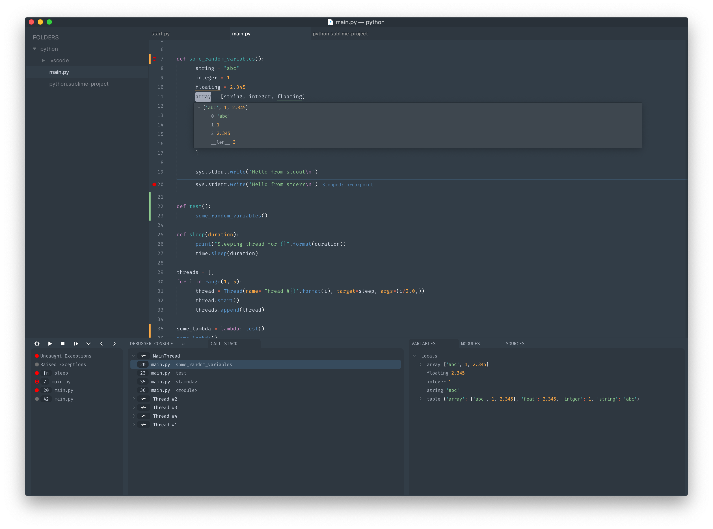

# Sublime Debugger

Graphical Debugger for sublime text for debuggers that support the debug adapter protocol.

See [Debug Adapter Protocol](https://microsoft.github.io/debug-adapter-protocol/)



# Installing
  Using package control run `Package Control: Install Package` and select `Debugger`.

  or clone into your sublime Packages directory (If you are on Sublime Text 3 use the [st3 branch](https://github.com/daveleroy/sublime_debugger/tree/st3))

# Getting Started
This project attempts to match Visual Studio Code's Debugger fairly closely so their documentation can be pretty helpful. See [https://code.visualstudio.com/docs/editor/debugging](https://code.visualstudio.com/docs/editor/debugging)

## Debuggers
This project comes with some pre-configured debuggers (They can be installed using ```Debugger: Install adapters```)

##### LLDB
- See https://github.com/vadimcn/vscode-lldb

##### Chrome
- See https://github.com/Microsoft/vscode-chrome-debug

##### Firefox
- See https://github.com/firefox-devtools/vscode-firefox-debug

##### Node
- For an overview see https://code.visualstudio.com/docs/nodejs/nodejs-debugging
- See https://github.com/microsoft/vscode-node-debug2

##### Python
- For an overview see https://code.visualstudio.com/docs/python/debugging
- See https://github.com/Microsoft/vscode-python

##### Go
- For an overview see https://github.com/golang/vscode-go/blob/master/docs/debugging.md
- See https://github.com/golang/vscode-go

##### PHP
- See https://github.com/felixfbecker/vscode-php-debug

##### Java
- Requires [LSP](https://packagecontrol.io/packages/LSP) and [LSP-jdtls](https://packagecontrol.io/packages/LSP-jdtls)
- See https://github.com/redhat-developer/vscode-java

##### Emulicious Debugger
- See https://github.com/Calindro/emulicious-debugger

## Setup
- Open the debug panel
  - from the command palette `Debugger: Open`

- Install a debug adapter by running: ```Debugger: Install adapter``` from the command palette.

- Add a configuration ```Debugger: Add Configuration``` from the command palette (or add one manually, see below).
  - Configurations are added to `debugger_configurations` to your sublime-project and use the same configuration format as Visual Studio Code
  - Consult the debugger specific documentation links above for creating a configuration for your debugger. Most debuggers come with some configuration snippets to choose from but I highly recommend looking at the documentation for the debugger.
  - Variable substitution: variables like `${file}` are supported but the list of supported variables differs from VSCode. The supported values are those listed at http://www.sublimetext.com/docs/build_systems.html#variables plus the VSCode-specific `${workspaceFolder}` that resolves to the path of the first workspace folder.

- Your configuration will look something like the following but with some debugger specific fields.
```
"debugger_configurations" : [
    {
        "name" : "Name of your configuration",
        "request" : "launch"|"attach",
        "type" : "debugger name",
         ...
    }
]
```

- Start debugging
  - click the gear icon to select a configuration to use
  - click the play icon to start the debugger or run `Debugger: Start` (if no configuration is selected it will ask you to select or create one)

## Tasks
Tasks are based on sublime build_systems with more integration so they can be used more seamlessly while debugging. When errors occur while running a task they are reported in the debugger ui (problem detection is the same as sublime, you must add `file_regex` to your task)

see https://www.sublimetext.com/docs/build_systems.html

Tasks are basically the same as sublime builds but there are a few additional parameters.
`name` which will show up in the debugger UI and be the name of the panel

```
"debugger_tasks" : [
    {
        "name" : "Name of your task",
        "cmd" : ["task", "command"],
         ...
    }
]
```
- Tasks can be run with `Debugger: Run Tasks`
- You can run tasks before and after debugging by adding `pre_debug_task` or `post_debug_task` to your configuration specifying the name of the task to run.


## Settings
Settings can be adjusted with `Preferences: Debugger Settings`

for a full list of settings see [debugger.sublime-settings](Debugger.sublime-settings)

## Troubleshooting
- To fix issues with things aligning correctly or the last panel not being visible try adjusting the `internal_font_scale` and `internal_width_modifier` in the settings
- Look in the debug console for errors (usually red)
- Look in the sublime console for errors
- Try the same configuration/adapter in Visual Studio Code (There is a good chance your issue is with the adapter so check out the outstanding issues for it)
